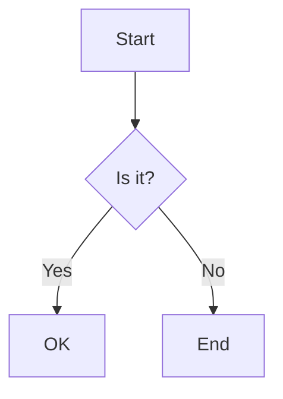
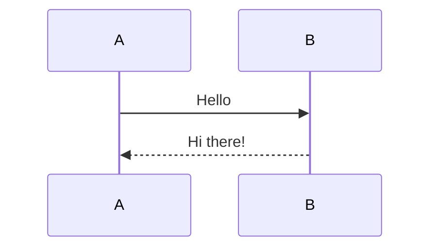
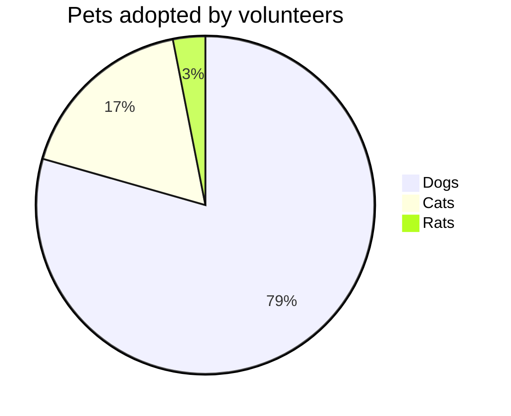
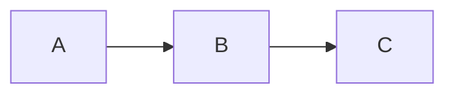

# Sample Markdown with Mermaid Diagrams

This is a sample markdown file containing multiple Mermaid diagrams for testing.

## Valid Flowchart



## Valid Sequence Diagram



## Invalid Diagram

```mermaid
flowchart TD
    A--B
```

## Valid Pie Chart



Some regular text here.

## Another Valid Flowchart



That's all the diagrams!
